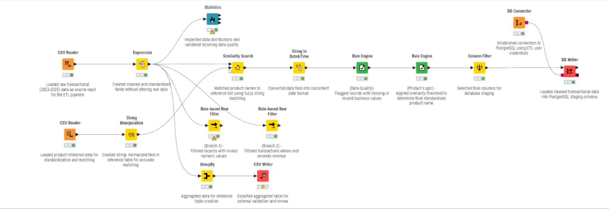
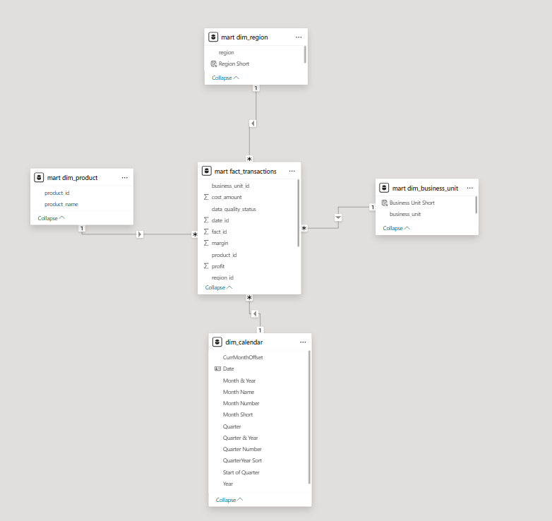

# Technical Implementation
_End-to-End Financial & Operational Analytics Pipeline_

## Purpose
This document details the **technical design and implementation of the end-to-end analytics pipeline,** covering ETL processing, PostgreSQL data modeling, and architectural decisions. It is intended to demonstrate real-world analytics engineering practices, including data quality handling, layered architecture, and BI-ready modeling.

The implementation mirrors enterprise analytics environments **by enforcing clear separation between ingestion, cleansing, modeling, and reporting layers.**

---
## Architecture Overview

**End-to-End Flow:**

```text
Raw CSV Files
→ KNIME ETL (Cleaning & Validation)
→ PostgreSQL Staging Layer
→ PostgreSQL Star Schema (Mart)
→ Power BI Analytics
```

- Raw transactional CSV files are ingested via KNIME
- Data is cleaned, validated, and standardized
- Cleaned data is written to PostgreSQL staging tables
- A star schema is built in the mart layer
- Power BI consumes the star schema for analytics

**Technology Stack**

- **ETL:** KNIME Analytics Platform
- **Database:** PostgreSQL
- **Schemas:** staging, ref, mart
- **Analytics:** Power BI

---

## ETL Design & Workflow


*KNIME workflow illustrating raw data ingestion, product standardization, data quality validation, and loading into PostgreSQL staging tables.*

### Raw Data Ingestion
_CSV Reader_

- Raw transactional data and reference product data are ingested from CSV files
- No transformations are applied at ingestion
- Raw values are preserved to support traceability and auditing

### Preprocessing & Field Standardization
_Expression node + String Manipulation node_

- Cleaned fields are derived using controlled transformations
- Raw columns are not overwritten
- Reference product data is normalized independently to ensure stable matching baseline

This approach separates **raw ingestion from cleaned representations,** supporting auditability.

### Product Standardization (Fuzzy Matching)
_Similarity Search node_

**Design choice:** Real-world product names contain typos and formatting inconsistencies

**Configuration**
- Distance metric: Levenshtein (normalized)
- Neighbor selection: Nearest match
- Neighbor count: 1

**Outcome:**
- High-confidence matches replaced with reference values
- Low-confidence matches preserved to avoid false positives

### Data Type Normalization
_String to Date&Time node_

- Date fields are explicitly converted to proper date/time data types
- Prevents casting issues in downstream systems
- Ensures compatibility with PostgreSQL and BI tools

### Data Quality Classification
_Rule Engine_

Validation rules include:
- Missing or invalid cost values
- Negative revenue
- Invalid unit counts

Rather than dropping data, **records are classified and flagged, enabling auditability and downstream QA.**

### Parallel Quality Branches
_Rule-based filters + GroupBy node_

Parallel branches are used to:
- Segment valid vs. exception records
- Enable optional aggregation and audit outputs
- Support quality review without disrupting the main pipeline

This design supports both **operational analytics and data quality monitoring.**

### Final Staging Shape
_Column Filter_ 

Design principle:
- Only analytics-ready columns are used for the database
- Intermediate helper fields are removed before persistence

### PostgreSQL Load
_DB Connector + Writer_

- Data is written using a dedicated ETL database user.
- Write access is restricted to approved schemas.
- Deterministic table creation behavior is enforced.

**Target Table:**
`staging.transactions_clean`

This enforces a clear separation between ETL transformation logic and database storage responsibilities, **reducing coupling and strengthening data governance.**

---

## Database & Schema Design
The PostgreSQL database is structured to simulate a production analytics environment.

### Schema Layers

| Schema | Purpose |
|--------|--------------|
| `staging` | Clean transactional (ETL outputs) |
| `ref` | Reference and lookup tables |
| `mart` | Analytics & reporting layer (facts and dimensions) |

A dedicated ETL user is granted schema-scoped permissions, **reinforcing separation of duties and security best practices.**

**View the Schema and permissions setup:** [here](sql/schemas_and_permissions_setup.sql)

### Data Modeling (Star Schema)
The modeling phase transforms clean transactional data into an analytics-optimized star schema that supports:

- Efficient querying
- BI tools (Power BI)
- Scalable aggregation
- Clear fact/dimension separation

**All modeling is derived from: `staging.transactions_clean`**

No transformations are performed directly on raw CSVs at this stage.

### Star Schema Design


*PostgreSQL star schema illustrating the relationship between fact and dimension tables in the analytics layer.*

A star schema was selected due to:

- Simple, predictable joins
- BI tool compatibility
- Read-optimized performance
- Industry-standard dimensional modeling practices

> **Note on Date Handling**
>
> The warehouse includes a `mart.dim_date` dimension derived from transactional dates to support consistent joins and filtering.
>  
> For advanced time intelligence (YoY, MoM, rolling periods), Power BI uses a dedicated calendar table at the semantic layer.  
>  
> This approach mirrors real-world BI implementations where the warehouse provides a clean date dimension, while the BI layer enhances it for analytical flexibility.

### Dimension Tables
Each dimension:

- Represents a single business entity
- Uses a surrogate key (`SERIAL`)
- Contains one row per unique value

**Dimensions implemented:**

| Dimension Table | Description | Source Column |
|-----------|-----------|-------|
| `mart.dim_date`   | Calendar attributes | `transaction_date` |
| `mart.dim_business_unit`   | Departments | `business_unit_clean` |
| `mart.dim_region` | Geographic regions | `region_clean`  |
| `mart.dim_product`  | Product names | `product_clean`  |


### Fact Table
The fact table is populated by:

- Joining staging data to dimension tables
- Replacing text attributes with surrogate keys
- Preserving numeric measures without additional transformation

This ensures consistency, performance, and analytical flexibility.

**Fact Table implemented:** `mart.fact_transactions`

**Grain:**
One row = one transaction

**Measures:**
- Units processed
- Revenue amount
- Cost amount

**Derived Metrics**
- Profit
- Margin

**Foreign keys:**
- `date_id`
- `product_id`
- `business_unit_id`
- `region_id`

Foreign keys enforce referential integrity and enable consistent analytical joins. Degenerate dimensions (e.g., transaction_id) are retained at the fact level where appropriate.

**All analytics-facing dimension and fact tables are created in the `mart` schema, serving as the analytics layer.**

**View the Fact and Dimension Table Creation:** [here](sql/fact_and_dimension_table_creation.sql)

## Separation of ETL, Modeling, and Analytics
A core design principle of this project is the clear separation of concerns across the analytics pipeline:

- **ETL** is responsible for data cleansing, validation, and standardization  
- **Data modeling** focuses on structuring data for analytical performance and BI consumption  
- **Analytics and reporting** are handled downstream in Power BI without heavy transformation  

This separation **improves maintainability, scalability, and trust in analytical outputs.**

## Data Quality & Governance
This project emphasizes trustworthy, auditable analytics through the following principles:

- No silent overwrites of source or cleaned values  
- All standardization decisions are explicit and traceable  
- Validation logic is rule-based and explainable  
- Edge-case and anomalous records are intentionally preserved for analysis

This mirrors governance practices used in regulated enterprise environments.

## Scalability & Production Considerations
While this project operates on a static dataset, the architecture is designed to support production-scale extensions, including:

- Scheduled pipeline execution (KNIME Server or cron-based orchestration)
- Incremental data loads to replace full refreshes
- Partitioning of large fact tables to improve query performance
- Monitoring of row counts, load failures, and data anomalies
- Controlled promotion of data from staging to mart layers

## Summary
This technical implementation demonstrates the ability to design and execute a production-style analytics pipeline from raw data ingestion through BI-ready reporting.

The project shows:
- Practical handling of imperfect enterprise data
- Thoughtful pipeline layering to support scalability and governance
- Dimensional modeling aligned with analytical performance needs
- Clear alignment between technical decisions and business analytics use cases

The implementation emphasizes engineering discipline, data trust, and decision-oriented design core requirements in real-world analytics environments.


